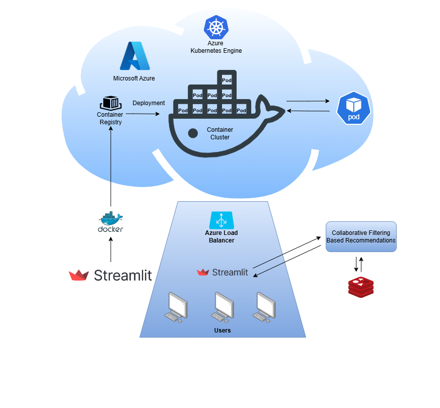

## Cloud-Based-Game-Recommender-System

### Overview

A recommender system is a machine learning approach used to predict user preferences and surface relevant items from large and complex datasets. In this project, I built a cloud-based videogame recommender system using a collaborative filtering approach, leveraging user–item interaction patterns to generate personalised game recommendations at scale. 

### System Design

The model learns similarities between users and games based on historical interaction data, allowing it to identify patterns in user preferences and generate personalised recommendations. By leveraging collaborative filtering, the system can predict future interests and continuously improve recommendation accuracy as more data becomes available.

### Deployment & Infrastructure

To provide an interactive user experience, I built a frontend web application using Streamlit, with a Python-based backend handling data processing and API integration. The system was containerised using Docker and deployed on Microsoft Azure Kubernetes Service (AKS).

An Ingress-based load balancer distributes incoming traffic across multiple pods, ensuring scalability, high availability, and efficient request handling. The application is exposed through a stable external endpoint, allowing users to access the system reliably.

### Goal & Future Improvements

The system is designed to enhance user engagement and support game discovery through personalised recommendations. Looking ahead, I identified opportunities to move the system closer to production by improving the user experience with a more polished interface and extending the platform with an AI-powered chatbot to assist users with discovery and queries.

Future improvements include integrating real-time (online) recommendation algorithms and expanding the system to support additional domains such as music and e-commerce.

## Architecture

  

## Interaction of the various components
The machine learning application is built as an interactive web interface using Streamlit, which serves as the frontend for user interaction. The application is containerised using Docker and deployed on Microsoft Azure Kubernetes Service (AKS) for scalable execution.

A Kubernetes load balancer exposes the application to external users and distributes incoming requests across multiple pods, ensuring efficient request handling and high availability. When a request is received, it is routed to a pod running the Streamlit application, where the collaborative filtering algorithm processes the input and generates personalised recommendations.

To support scalability, the system can dynamically scale by increasing the number of pods based on demand. A Redis instance, deployed in a separate pod, is used to store and update computed recommendations, enabling faster data retrieval and improved performance.

## Collaborative filtering (Training):
The recommendation algorithm is built using a collaborative filtering approach, focusing on modelling user–user and item–item similarity through interaction matrices. During development, different similarity metrics—including Euclidean distance, Pearson correlation, and cosine similarity—were evaluated to determine the most effective method for capturing relationships between users and games.

The system operates on a user–item interaction matrix derived from the RAWG-based dataset, where user ratings represent preference signals. For a given active user, similarity scores are computed against other users based on their interaction patterns. These similarities are then used to construct a weighted matrix, where users with higher similarity contribute more strongly to the recommendation process.

The final recommendation matrix is generated by aggregating and normalising these weighted interactions to mitigate scale differneces and produce a ranked set of personalised game recommendations.

Dataset employed: https://www.kaggle.com/datasets/jummyegg/rawg-game-dataset/data

  

## Collaborative filtering (Evaluation):
The performance of the recommendation algorithm is evaluated using both error-based and ranking-based metrics. To assess prediction accuracy, metrics such as Mean Squared Error (MSE) and Root Mean Squared Error (RMSE) are used to measure the difference between predicted and actual user ratings.

In addition to accuracy, the system is evaluated based on its ability to generate relevant recommendations using the Hit Rate Ratio (HR@N). For each user, the model generates a top-N list of recommended games. A "hit" is recorded if the list contains an item the user has previously interacted with or rated positively. The overall hit rate is then calculated as the proportion of users for whom at least one relevant recommendation is successfully identified.

This combination of metrics provides a balanced evaluation of both prediction accuracy and recommendation relevance.

  

## Results

The system successfully demonstrated the core functionality of a cloud-based collaborative filtering recommender. The model was able to generate personalised game recommendations by identifying patterns in user–item interactions, confirming that the underlying recommendation logic was effective.

From a system perspective, the application performed reliably under moderate load, supporting up to 20 concurrent users while maintaining responsive performance. Integration between the recommendation engine, user interface, and cloud infrastructure was successfully achieved, resulting in a cohesive end-to-end system.

Evaluation through testing showed that the model could produce relevant top-N recommendations, with users receiving meaningful suggestions based on their interaction history. However, performance was influenced by the sparsity and configuration of the interaction data, which limited the overall accuracy and consistency of recommendations.

One key observation was that while the system performed well at a functional level, scalability became a challenge under increased load. This highlighted the importance of more robust infrastructure configuration and optimisation when deploying machine learning systems in cloud environments.

Future improvements would focus on enhancing the quality and density of interaction data, optimising similarity calculations, and implementing real-time (online) recommendation techniques. Additionally, refining the cloud deployment strategy would improve scalability and system resilience under higher demand.

Overall, the project demonstrates a working end-to-end recommendation system, combining machine learning, cloud deployment, and system integration, while providing a strong foundation for further development toward a production-ready solution.

## License
This project is licensed under the MIT License - see the [LICENSE](LICENSE.md) file for details.

## Contributing

Contributions are welcome! Please feel free to submit a Pull Request.

1. Fork the repository
2. Create your feature branch (`git checkout -b feature/AmazingFeature`)
3. Commit your changes (`git commit -m 'Add some AmazingFeature'`)
4. Push to the branch (`git push origin feature/AmazingFeature`)
5. Open a Pull Request

---

 Made with ❤️ by Jeduthun Idemudia 

